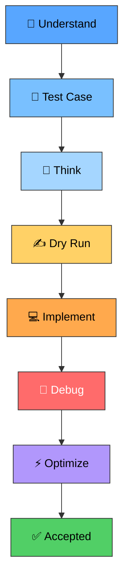

<div align="center">


<br/>

<a href="#">
  
</a>

<br/><br/>


</div>

<br/>

## 🧠 About This Repository

This repository contains my solutions to problems from my DSA Sheet.

The goal isn't just to collect `Accepted` submissions. I'm focusing on:

<table align="center">
<tr>
<td>

🧩 Understanding the problem before coding
📝 Dry-running algorithms with test cases
🔍 Finding patterns and observations
⚙️ Improving brute-force solutions

</td>
<td>

🚀 Learning optimal approaches
🐛 Debugging my own mistakes
📊 Understanding Time & Space Complexity
💡 Building problem-solving intuition

</td>
</tr>
</table>

<div align="center">

**`Solve`** → **`Analyze`** → **`Optimize`** → **`Implement`** → **`Learn`**

</div>

<br/>

## 📚 Topics

The repository is organized by DSA topics so that the solutions are easy to navigate and revise.

<div align="center">

| 📂 Topic | 📂 Topic | 📂 Topic |
|:---:|:---:|:---:|
| Arrays | 2D-Arrays | Strings |
| Searching | Sorting | Linked-List |
| Stack | Queue | Maps-and-Sets |
| Heap | Binary-Tree | BST |
| Greedy | Dynamic-Programming | Graphs |

</div>

```text
DSA-Sheet-Solver/
│
├── Arrays/
├── 2D-Arrays/
├── Strings/
├── Searching/
├── Sorting/
├── Linked-List/
├── Stack/
├── Queue/
├── Maps-and-Sets/
├── Heap/
├── Binary-Tree/
├── BST/
├── Greedy/
├── Dynamic-Programming/
├── Graphs/
└── README.md
```

> More topics will be added as I progress through the DSA Sheet.

<br/>

## 📈 Learning Philosophy

I don't want this repository to be just a collection of copied solutions.
For every problem, I try to follow this flow:

<div align="center">



</div>

Sometimes the first approach works. Sometimes it doesn't. **And that's okay.**
The failed approaches are part of the learning process.

<br/>

## 🛠️ Tech Stack

<div align="center">


</div>

<br/>

## 📌 My Rules

| # | Rule | Description |
|:--:|:--|:--|
| 1️⃣ | **Understand Before Implementing** | I don't want to blindly code the first idea that comes to my mind. |
| 2️⃣ | **Test With Examples** | I try to manually dry-run my approach before implementing it. |
| 3️⃣ | **Find Counterexamples** | If an approach works on one testcase, I try to find a testcase that can break it. |
| 4️⃣ | **Optimize After Understanding** | First understand the straightforward approach, then look for better complexity. |
| 5️⃣ | **Learn From Mistakes** | Compilation errors, wrong answers and failed approaches are part of the process. |

<br/>

## 🚀 The Goal

This repository isn't about having the biggest number of solved problems.

It's about becoming better at:

<div align="center">

**Seeing a problem → breaking it down → finding the pattern → designing the algorithm → implementing it independently.**

</div>

<br/>

## 🤝 Connect

I'm documenting my DSA learning journey and continuously adding new problems and approaches to this repository.

If you're also preparing for placements, interviews, or simply trying to get better at DSA:

<div align="center">

### Let's learn, solve, fail, debug and improve together. 🚀


</div>

<br/>

<div align="center">

### ⭐ If you find this repository useful, consider giving it a star!

**One problem at a time. One concept at a time.**


</div>
